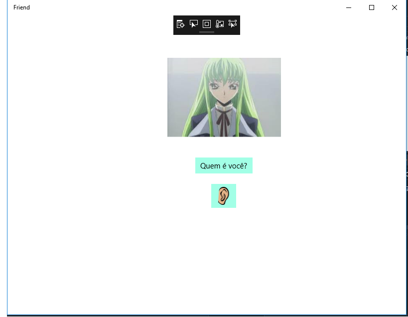
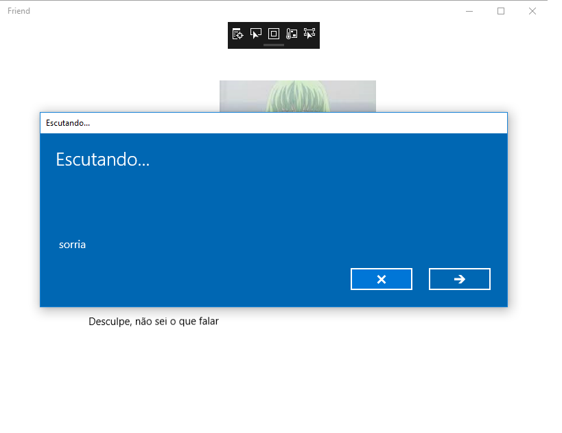
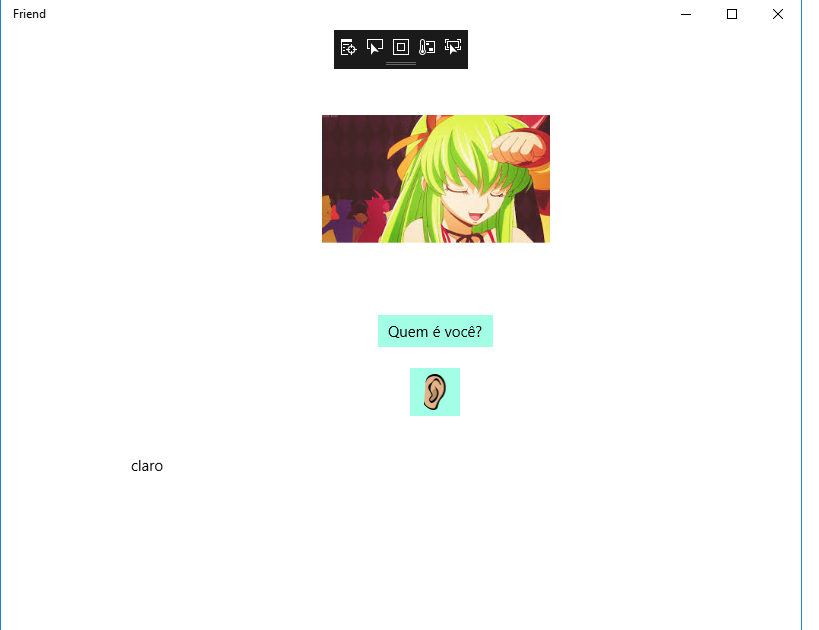
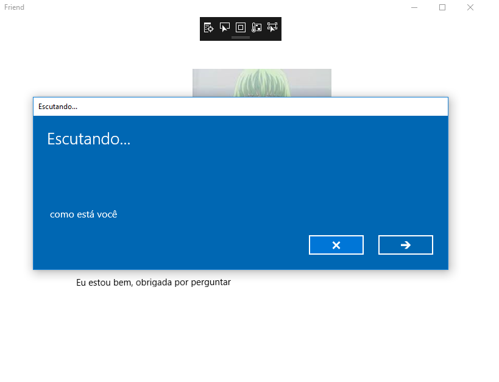
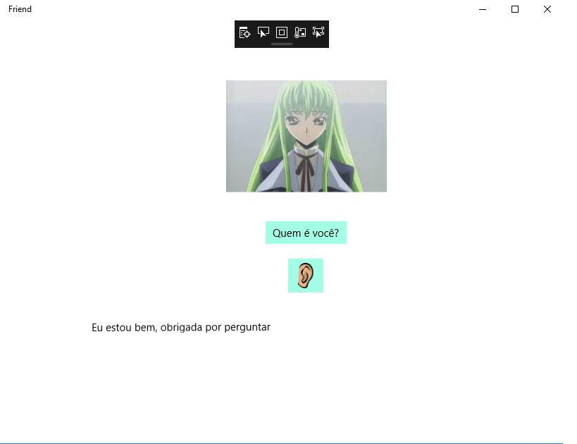
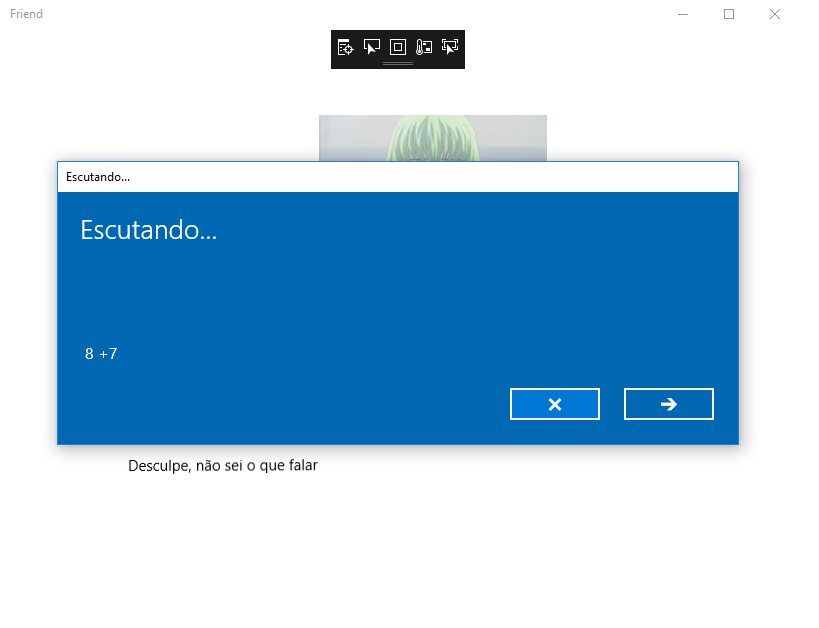
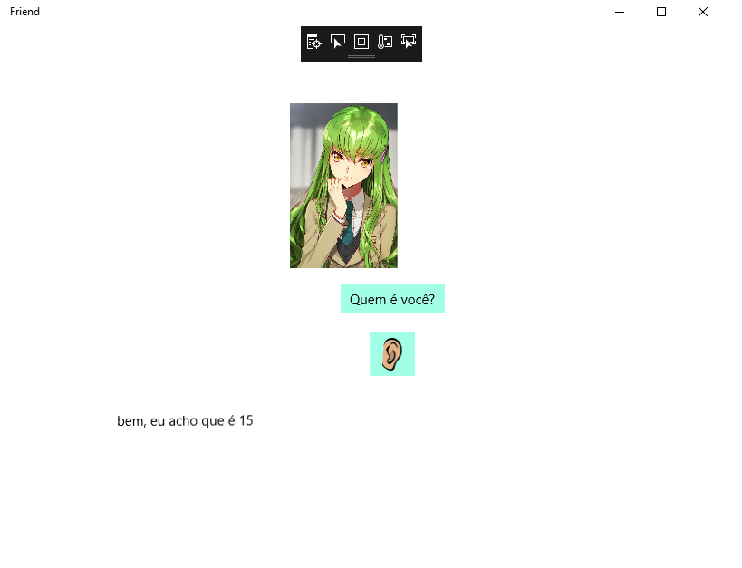
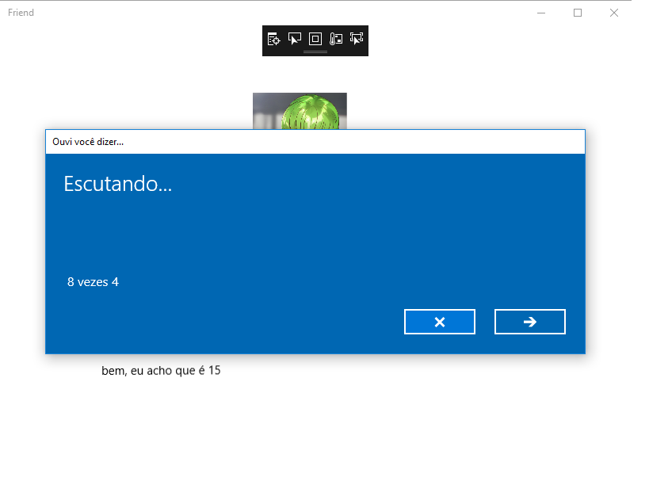
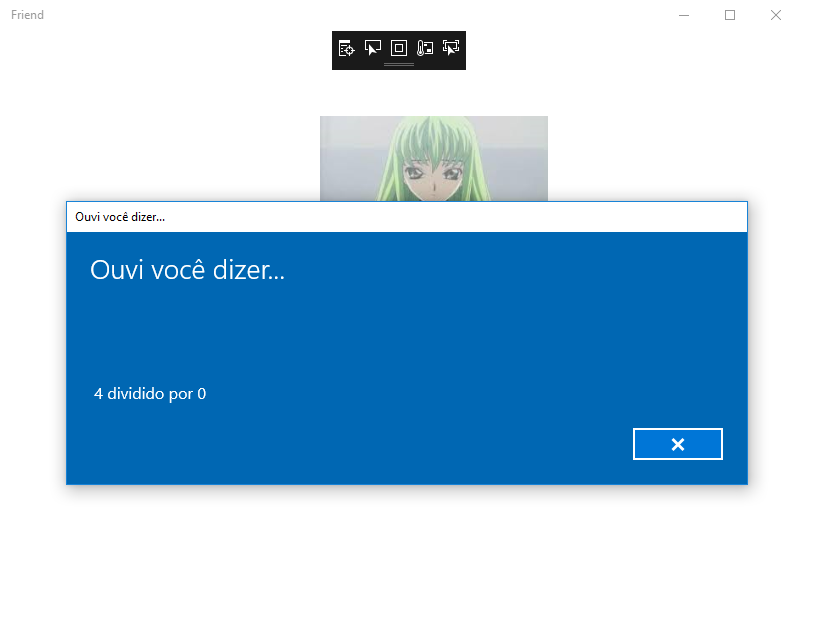

# Amigo-virtual-com-reconhecimento-de-voz
Este programa é capaz de reconhecer a voz de entrada no microfone e dar uma resposta baseado no que foi escutado, inclusive fazer operações básicas como (+, -, *, /)

# Plataforma
.NET

# Linguagem
C Sharp

# Funções
Reconhecer entrada de áudio e converter para um valor String.
Entregar uma resposta em forma de audio.
Se a pergunta for uma operação matemática ele irá resolver.
A imagem principal irá mudar dependendo do que ouvir, alterando sua expressão facial.

